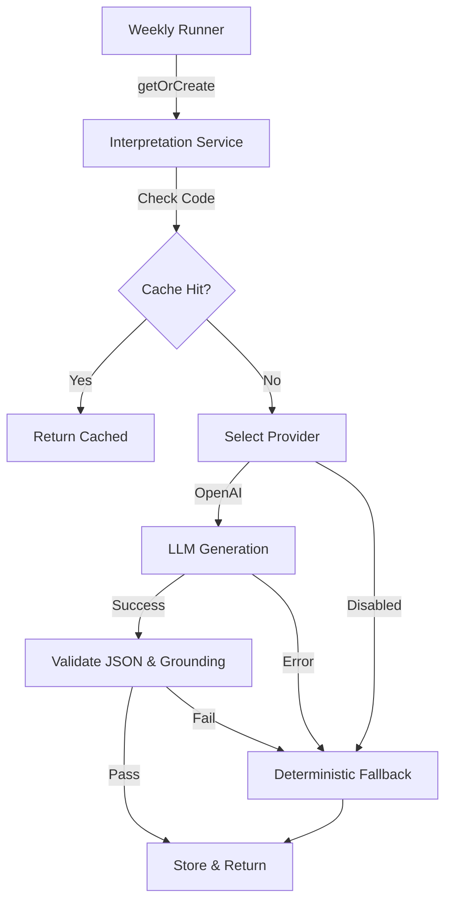

# Phase 13: LLM Integration Production Hardening

## Overview
Phase 13 introduces a production-grade LLM integration for generating weekly interpretations. 
It emphasizes strict safety, determinism, and cost governance.

## Architecture

### 1. Provider Abstraction (`services/llm/`)
- **`types.ts`**: Defines strict `LLMProvider` interface returning structured JSON or typed errors.
- **`config.ts`**: Centralized configuration reading from env variables, enforcing hard safety caps (max tokens, concurrency).
- **`openai.ts`**: Production implementation using `fetch`, with exponential backoff, circuit breaking (timeout), and strict `response_format: { type: 'json_object' }`.
- **`disabled.ts`**: Default fallback provider when no API key is present.

### 2. Service Orchestration (`services/interpretation/service.ts`)
The service now orchestrates generation:
1. **Idempotency Check**: Returns cached record if invalidation hash matches.
2. **Mode Selection**: Uses LLM if configured, otherwise falls back to deterministic generator.
3. **Concurrency Limiting**: Enforces max parallel LLM calls (default 2) to prevent rate limits.
4. **Validation Pipeline**:
   - **JSON Parse**: Strict parsing.
   - **Schema Validation**: Typescript interface matching.
   - **Policy Enforcement**: Semantic gating (e.g., monitor-only mode).
   - **Grounding Verification**: Validates `grounding_map` against input.
5. **Fallback**: If ANY step fails (LLM error, invalid JSON, grounding failure), it falls back to the deterministic generator (Phase 9 logic).
6. **Persistence**: Stores result to DB.

### 3. Grounding Contract (`lib/interpretation/grounding.ts`)
- Every LLM generation must return a `grounding_map`.
- This map links every claim ref ID to a specific JSON path in the input.
- Prevents hallucination by requiring existence proof for all claims.

### 4. Zero-Hype Policy (`lib/interpretation/policy.ts`)
- **External Dominance**: If external factors dominate, internal actions are suppressed.
- **Monitor Only**: If metrics are stable/improving and no critical issues exist, we monitor only.
- **Strict Caps**: Limits number of focus items based on context.

## Data Flow

