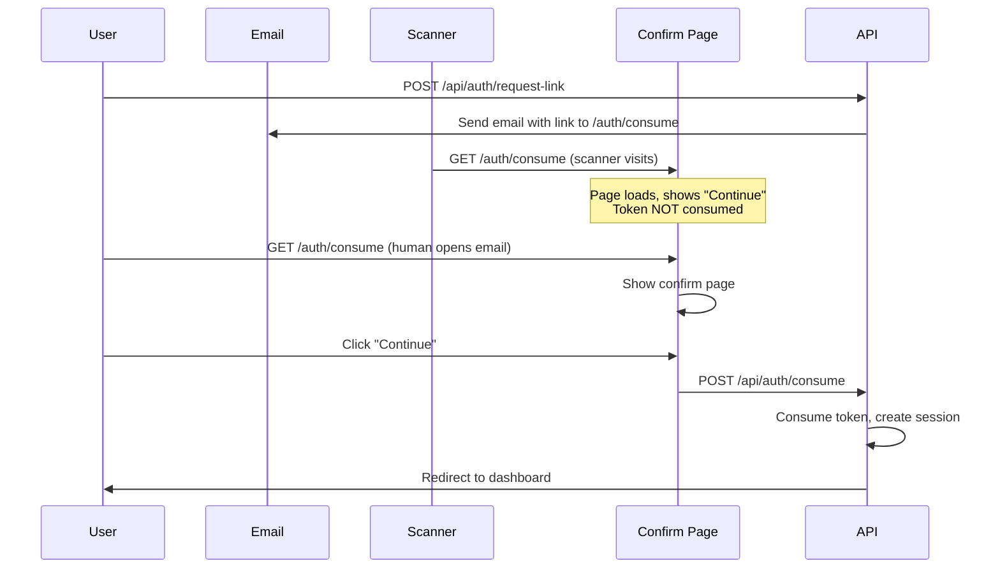

# Phase 36.4: Magic-Link Anti-Scanner Flow

## Root Cause

Email security scanners (e.g., Microsoft Safe Links, Proofpoint) automatically visit links in emails to check for threats. This consumes single-use tokens before the human can click.

## Solution

Introduce a **human confirm page** between the email link and token consumption:

```
Email Link → /auth/consume?token=...  (GET = show page, don't consume)
    ↓
User clicks "Continue"
    ↓
POST /api/auth/consume → { token }  (consumes token, redirects)
```

### New Flow Diagram



## Files Changed

| File | Change |
|------|--------|
| `app/(public)/auth/consume/page.tsx` | **NEW** - Human confirm page |
| `app/api/auth/consume/route.ts` | **MODIFIED** - POST-only, rejects GET with 405 |
| `services/email/transport.ts` | **MODIFIED** - Links to `/auth/consume` not `/api/auth/consume` |
| `app/api/internal/diag/login-token/route.ts` | **NEW** - Token diagnostic endpoint |

## Verification Commands

```bash
# Build and lint
npm run build
npm run lint

# Local E2E test (requires dev server on port 3001)
EMAIL_PROVIDER=test AUTH_BASE_URL=http://localhost:3001 \
  npx tsx scripts/verify_phase36_4_magic_link_scanner_e2e.ts

# Production token diagnostic
TOKEN=<token> INTERNAL_ADMIN_SECRET=<secret> \
  npx tsx scripts/verify_phase36_4_prod_token_diag.ts
```

## Troubleshooting

| Symptom | Cause | Solution |
|---------|-------|----------|
| "Method not allowed" | Old link still using GET | User needs new email |
| Token status: USED | Scanner or previous click | Request new link |
| Token status: EXPIRED | Link is >15min old | Request new link |
| Token status: NOT_FOUND | DB issue or token corrupt | Check logs, request new link |
